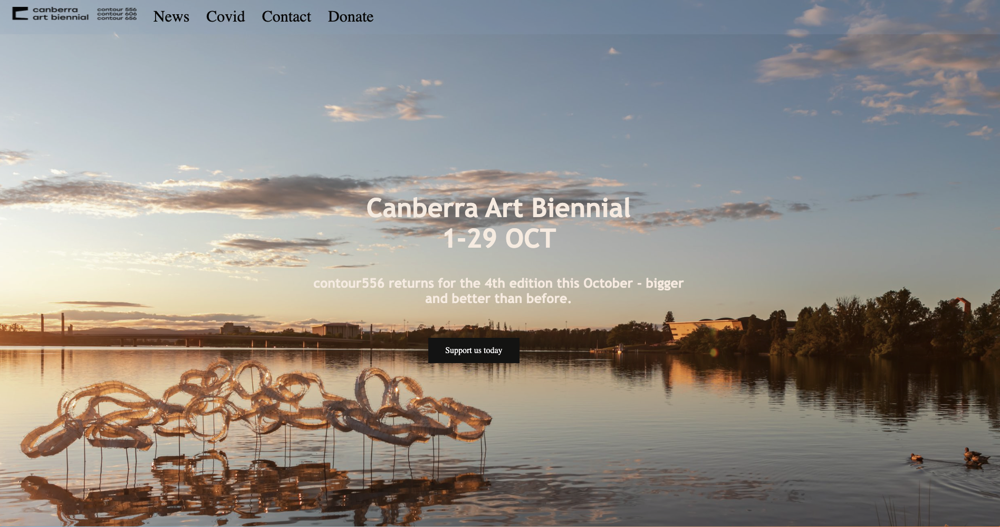
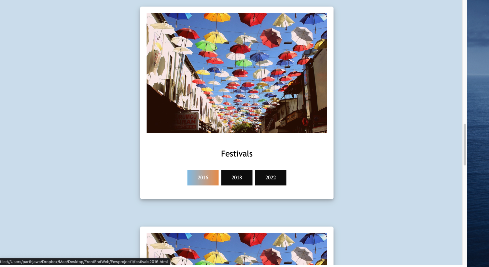
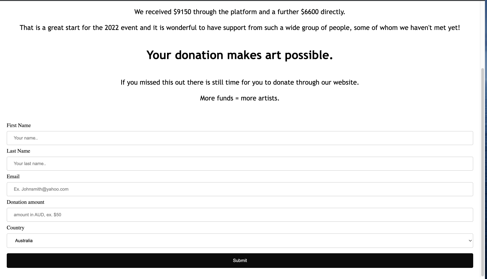
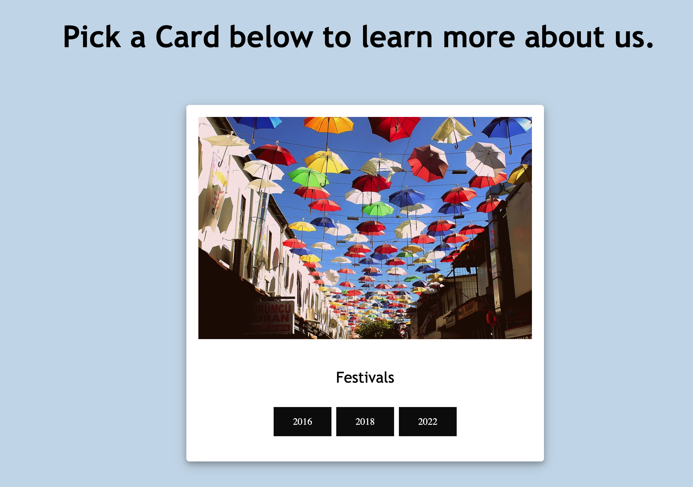
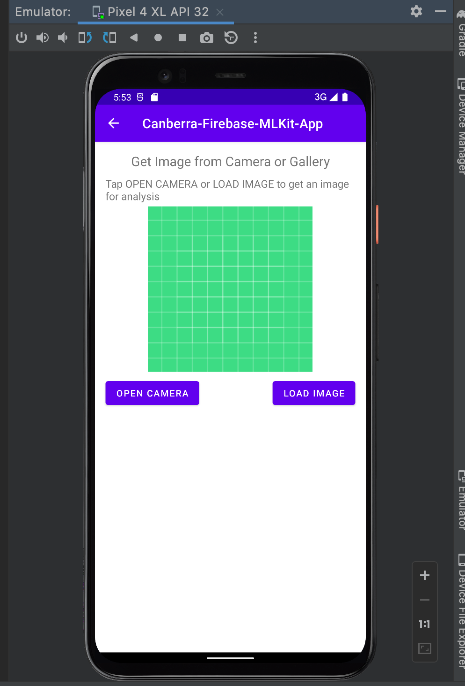
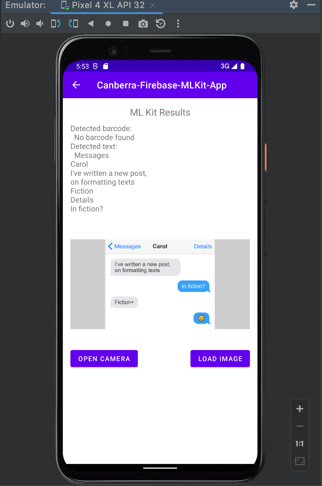

---
# set the layout to use, in this case, the homepage one
layout: layouts/homepage

# set the page title
title: My Portfolio

# We can set extra info here to use in our templates

hero:
    title: "Hi, I'm Parth, A Web Developer."
---

    <button class="button">Learn About me</button>

 

---
 

# My Work:
 

### I made a recreation of the Canberra Art biennial official website for one of the units I studied in the recent semester, where we pulled the content straight from the official website <a href="https://www.contour556.com.au/">Canberra Art Biennial</a> I basically added an arty theme to the project and made the content condense into a fewer section or pages.

 

   
 
 

### I felt like there was too much content on the nav bar rigth on the index page which I found was overwhelming to look at, so I made it appear as cards for user to pick as shown below:  

   

# AI recognition app

## I did this fun project which is basically a text and object recognizer, also for an unit I studied at Uni. We used Android Studio and Java to make this project.

   
   

---

 

# My Study:

 

## I am studying Bachelors of Software Engineering at University of Canberra,  and during my study I have learned the following languages displayed below with my confidence in them:

  Java : 70%  

html : 80% 

CSS : 80% 

JavaScript : 40% 

## Along with these Web Developement languages I have also learned some SQL and C++ for back-end Web Developement.

 

---
# My Future Expectations and plans: 
 

## I am currently starting to get my interest in wordpress developement as it is getting quite popular, along with a course I started to learn about social media marketing.
 

## My Future expectation is to land a job in one of fields available to work in for a software engineering student.
---

